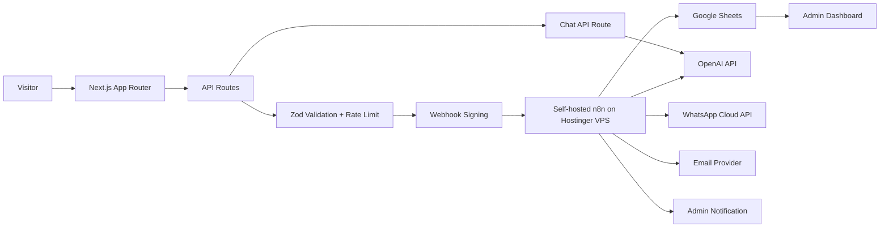
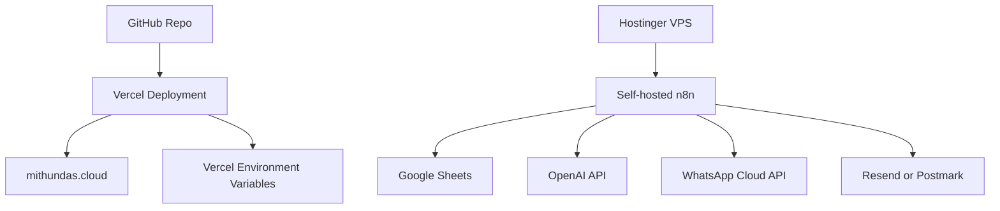

# Mithun Das AI Automation Business Platform Blueprint

Domain: mithundas.cloud  
Positioning: AI Business Automation Engineer  
Primary outcome: qualified automation consulting leads  
Build posture: production-ready client acquisition system, not a portfolio

## 1. Strategic Positioning

### Core Positioning Statement

I design operational AI systems that eliminate repetitive work, connect disconnected business software, and engineer reliable business workflows using AI, APIs, and automation.

### Market Category

AI Business Automation Engineering.

This should feel closer to a specialist automation systems firm than a freelancer website. The site should signal that Mithun Das can analyze business operations, design reliable automation architecture, implement the technical workflow, and expose observability around the result.

### Primary Trust Signals

- Engineering education: B.E. in Electronics & Instrumentation Engineering, Jadavpur University; M.Tech in Systems & Control Engineering, NIT Warangal.
- Systems and control background: strong fit for feedback loops, automation reliability, failure handling, and operational workflows.
- Implementation stack: Next.js, TypeScript, n8n, OpenAI API, WhatsApp Cloud API, webhooks, Google Sheets, Node.js, APIs.
- Demonstrable systems: live workflow demo, chatbot, lead qualification flow, automation status timeline, dashboard preview.

### Messaging Rules

Use:

- Operational AI systems
- Business workflow automation
- AI-assisted operations
- API-integrated automation
- Automation architecture
- Lead routing and follow-up systems
- Workflow reliability

Avoid:

- AI developer
- Web developer
- Full-stack freelancer
- Portfolio projects
- Available for work
- Skill bars
- Generic resume copy

## 2. Information Architecture

### Primary Pages

1. Home
   Purpose: position, qualify, demonstrate capability, convert.
2. Systems
   Purpose: present services as operational systems, not generic services.
3. Workflow Demo
   Purpose: let prospects interact with a simulated automation pipeline.
4. Case Studies
   Purpose: show business problem, architecture, decisions, impact.
5. Process
   Purpose: reduce unnecessary calls by explaining engagement model.
6. Insights
   Purpose: publish technical breakdowns and automation playbooks.
7. Contact / Automation Assessment
   Purpose: collect qualified requirements and trigger backend automation.
8. Admin
   Purpose: private lead and workflow operations dashboard.

### Utility Pages

- Privacy Policy
- Terms
- Cookie / tracking notice
- Thank-you page
- Error page
- Not found page

## 3. User Journey

### Visitor Types

- Business owner with repetitive operational pain.
- Agency owner needing lead routing or fulfillment automation.
- Operations manager with disconnected systems.
- Founder exploring AI assistants or WhatsApp automation.
- Technical evaluator checking implementation credibility.

### Journey

1. Arrival
   Visitor sees an infrastructure-style hero, concrete positioning, operational metrics, and a workflow visual.
2. Problem Recognition
   Visitor sees common operational failure patterns: manual follow-ups, duplicate entry, slow response, poor visibility.
3. Capability Validation
   Visitor interacts with workflow demo and sees architecture-level service descriptions.
4. Fit Evaluation
   Visitor reviews qualifying questions, process, budget ranges, timelines, and FAQ.
5. Conversion
   Visitor submits automation assessment or chats with AI assistant.
6. Backend Automation
   Lead is validated, scored, summarized, stored, notified, and acknowledged.
7. Follow-up
   Admin dashboard shows lead status, next action, AI summary, and workflow health.

## 4. Conversion Funnel

### Top Of Funnel

- SEO pages for AI workflow automation, WhatsApp automation, CRM automation, n8n consultant, AI customer support automation.
- LinkedIn and technical content linking to workflow demo and case studies.

### Middle Of Funnel

- Interactive workflow demo.
- System architecture diagrams.
- Case studies with engineering decisions.
- FAQ that filters low-fit prospects.

### Bottom Of Funnel

- Automation assessment form.
- Chatbot lead qualification.
- Discovery call CTA only after enough context is collected.
- Thank-you page with expected next steps.

### Conversion Events

- `workflow_demo_started`
- `workflow_demo_completed`
- `chatbot_opened`
- `lead_form_started`
- `lead_form_completed`
- `qualified_lead_submitted`
- `discovery_call_clicked`
- `case_study_viewed`

## 5. Navigation Structure

Desktop navigation:

- Systems
- Demo
- Case Studies
- Process
- Insights
- Start Assessment

Mobile navigation:

- Systems
- Demo
- Process
- Contact

Primary CTA: Start Automation Assessment  
Secondary CTA: Run Workflow Demo

The navigation should avoid "About" as a primary sales page. Profile credibility can live inside Home, Process, and footer.

## 6. Homepage Structure

| Section | Business Objective |
|---|---|
| Hero | Establish premium technical positioning in 5 seconds |
| Operating Metrics | Show business outcomes and reliability mindset |
| Problem Matrix | Help visitors recognize operational friction |
| Automation Philosophy | Explain systems thinking and engineering approach |
| Operational Systems | Present services as engineered workflows |
| Interactive Workflow Demo | Demonstrate capability before a call |
| AI Chatbot Entry | Qualify and educate visitors |
| System Architecture Preview | Show how frontend, API, n8n, AI, sheets, email, WhatsApp connect |
| Case Study Cards | Prove repeatable business impact |
| Workflow Monitoring Panel | Communicate observability and reliability |
| Client Process | Reduce bad-fit calls |
| FAQ | Remove objections |
| Lead Qualification | Collect structured requirements |
| Final CTA | Convert serious prospects |

## 7. Hero Section

### Headline

Operational AI systems for businesses that have outgrown manual workflows.

### Subheadline

I design automation architectures that connect your CRM, forms, WhatsApp, email, spreadsheets, internal tools, and AI assistants into reliable business workflows.

### Primary CTA

Start Automation Assessment

### Secondary CTA

Run Workflow Demo

### Hero Visual

Animated infrastructure visual:

- Left: inbound events such as lead form, WhatsApp message, email, webhook.
- Center: orchestration layer with validation, routing, AI summary, retry logic, logs.
- Right: outputs such as CRM update, Google Sheets row, email, WhatsApp confirmation, admin alert.
- Bottom: execution timeline with statuses.

### Hero Metrics

- Response automation: under 60 seconds after valid lead submission.
- Workflow visibility: every step logged.
- Integration pattern: frontend -> API -> n8n -> data store -> notifications.
- Reliability posture: validation, retries, alerts, fallbacks.

### System Status

Use a small status cluster:

- API Gateway: operational
- n8n Orchestrator: operational
- Lead Pipeline: monitored
- AI Summary: active

These can be simulated on the public site, but the admin panel should reflect real status later.

## 8. Design System

### Visual Direction

Dark infrastructure interface with restrained contrast, technical surfaces, compact dashboards, and workflow diagrams. Avoid random glow decoration. Use motion to show state transitions, not ornament.

### Color Tokens

```ts
export const colors = {
  background: {
    app: "#070A0F",
    surface: "#0D1118",
    elevated: "#121824",
    inset: "#090D14"
  },
  border: {
    subtle: "#202938",
    default: "#2C3648",
    strong: "#3E4B63"
  },
  text: {
    primary: "#F4F7FB",
    secondary: "#AAB6C8",
    muted: "#728096",
    inverse: "#071018"
  },
  accent: {
    cyan: "#45D9FF",
    green: "#64E6A2",
    amber: "#F6C76B",
    red: "#FF6B7A",
    blue: "#6EA8FF"
  },
  status: {
    success: "#64E6A2",
    warning: "#F6C76B",
    error: "#FF6B7A",
    info: "#45D9FF"
  }
} as const;
```

### Typography

Recommended premium pairing:

- Primary UI and body: Inter or Geist Sans.
- Technical labels and code: Geist Mono or IBM Plex Mono.

Use tight, enterprise-style typography:

- Display: 56/64 desktop, 40/48 tablet, 32/40 mobile.
- H1: 48/56 desktop, 36/44 mobile.
- H2: 32/40 desktop, 28/36 mobile.
- H3: 22/30.
- Body: 16/26.
- Small: 14/22.
- Label: 12/18, uppercase only for system labels.

### Spacing Scale

```ts
export const spacing = {
  1: "4px",
  2: "8px",
  3: "12px",
  4: "16px",
  5: "20px",
  6: "24px",
  8: "32px",
  10: "40px",
  12: "48px",
  16: "64px",
  20: "80px",
  24: "96px"
} as const;
```

### Grid

- Max content width: 1200px.
- Dashboard sections: 12-column grid.
- Narrow content: 760px.
- Hero: 5/7 split on desktop; stacked on mobile.
- Cards: minmax(280px, 1fr).

### Radius

- `radius-sm`: 4px
- `radius-md`: 6px
- `radius-lg`: 8px
- `radius-xl`: 12px only for large panels or modals

### Shadows

Use shadows sparingly:

- `shadow-panel`: 0 12px 40px rgba(0,0,0,.28)
- `shadow-focus`: 0 0 0 3px rgba(69,217,255,.18)
- `shadow-status`: inset 0 0 0 1px rgba(255,255,255,.06)

### Animation Tokens

```ts
export const motion = {
  fast: "120ms",
  base: "200ms",
  slow: "420ms",
  easeOut: [0.16, 1, 0.3, 1],
  easeInOut: [0.65, 0, 0.35, 1]
} as const;
```

### Icon Style

Use lucide-react icons. Stroke width 1.75. Icons should represent functions: webhook, database, message, mail, bot, route, shield, activity, alert, check, clock.

## 9. Component Library

### Foundation Components

- `Button`
- `IconButton`
- `Input`
- `Textarea`
- `Select`
- `Checkbox`
- `RadioGroup`
- `Badge`
- `StatusPill`
- `MetricTile`
- `SystemPanel`
- `Timeline`
- `Stepper`
- `Tabs`
- `Modal`
- `Toast`
- `Tooltip`
- `ErrorBoundary`
- `LoadingState`
- `EmptyState`

### Business Components

- `WorkflowNode`
- `WorkflowEdge`
- `WorkflowExecutionTimeline`
- `ArchitectureDiagram`
- `ServiceSystemCard`
- `CaseStudyCard`
- `LeadQualificationForm`
- `ChatbotPanel`
- `AutomationHealthPanel`
- `IntegrationMatrix`
- `ProcessStage`
- `FAQAccordion`
- `AdminLeadTable`
- `LeadScoreBadge`
- `ExecutionLogViewer`

## 10. Services As Operational Systems

### AI Customer Support System

Problem: teams lose time answering repetitive questions and miss after-hours inquiries.  
Architecture: website/chat channel -> API -> AI response engine -> escalation rules -> CRM/sheet -> notification.  
Workflow: classify intent, retrieve approved FAQ context, answer safely, request missing details, escalate when uncertain.  
Impact: faster first response, lower manual support load, better lead capture.  
Deliverables: chatbot, system prompt, FAQ context, escalation flow, admin logs.  
Technologies: OpenAI API, Next.js API routes, n8n, Google Sheets, email.

### WhatsApp Lead Automation System

Problem: leads arrive from ads, forms, and WhatsApp but follow-up is slow or inconsistent.  
Architecture: lead event -> validation -> lead score -> WhatsApp Cloud API -> CRM/sheet -> admin alert.  
Workflow: capture, validate, summarize, acknowledge, route, follow up.  
Impact: faster response, fewer lost leads, consistent lead handling.  
Deliverables: lead flow, WhatsApp templates, n8n workflow, status tracking.  
Technologies: WhatsApp Cloud API, n8n, OpenAI API, Google Sheets.

### CRM And Operations Integration System

Problem: data is duplicated across forms, sheets, CRMs, inboxes, and internal tools.  
Architecture: event router -> normalization -> deduplication -> target systems -> audit logs.  
Workflow: ingest, clean, map fields, sync, log, notify.  
Impact: fewer errors, faster operations, better reporting.  
Deliverables: integration map, API connectors, retry policy, logs.  
Technologies: webhooks, Node.js, n8n, REST APIs.

### Document Processing And AI Summary System

Problem: teams manually read, classify, and summarize documents.  
Architecture: upload/email trigger -> validation -> AI extraction -> review queue -> storage -> notification.  
Workflow: receive file, validate, extract fields, summarize, flag uncertainty, route for review.  
Impact: reduced processing time and better handoff quality.  
Deliverables: extraction schema, AI prompt, review dashboard, logs.  
Technologies: OpenAI API, Next.js, n8n, Google Sheets or MongoDB.

### Internal Approval Workflow System

Problem: approvals happen across chat, email, and spreadsheets without visibility.  
Architecture: request form -> approval matrix -> notifications -> decision log -> dashboard.  
Workflow: submit, route, remind, approve/reject, store decision, notify requester.  
Impact: predictable approvals and fewer stalled tasks.  
Deliverables: approval engine, status dashboard, reminder automation.  
Technologies: Next.js, n8n, email, WhatsApp, Google Sheets.

## 11. Interactive Workflow Demo

### Demo Steps

1. Webhook Received
2. Input Validation
3. Lead Scored
4. Workflow Triggered
5. Google Sheets Updated
6. AI Summary Generated
7. WhatsApp Confirmation Queued
8. Email Confirmation Sent
9. Admin Notification Sent
10. Workflow Completed

### UI Behavior

- User clicks Start Workflow.
- Each node changes from idle to running to success.
- Timeline shows timestamps.
- Simulated logs appear in a side panel.
- Final output shows a sample AI summary and lead score.

### Purpose

This demo proves operational thinking. It should feel like a control panel, not a decoration.

## 12. AI Chatbot Architecture

### MVP Scope

No RAG, no vector database. Use context injection with approved content.

### Responsibilities

- Explain services.
- Ask qualifying questions.
- Recommend automation approaches.
- Collect project requirements.
- Suggest high-level architecture.
- Offer discovery call only when the lead is plausible.
- Escalate when uncertain.

### Guardrails

- Never claim integrations are already connected unless configured.
- Never provide legal, medical, or financial advice.
- Never guarantee exact ROI.
- Ask for missing business context.
- Clearly state when something needs a technical audit.

### Chatbot System Context

Include:

- Positioning statement.
- Service descriptions.
- FAQ.
- Process.
- Budget guidance.
- Supported and unsupported project types.
- Escalation rules.

## 13. Technical Architecture



### Frontend

- Next.js App Router.
- TypeScript.
- Tailwind CSS.
- Framer Motion.
- Server Components for static sections.
- Client Components only for interactive workflow demo, chatbot, forms, admin filters.

### Backend

- API routes for lead submission, chatbot, workflow events, admin reads.
- Zod validation.
- Rate limiting.
- Request signing to n8n.
- Structured logging.
- Environment-based secrets.

### Automation

- Self-hosted n8n on Hostinger VPS.
- Separate workflows for lead intake, notifications, AI summary, error alerts.
- Webhook authentication using shared secret or HMAC signature.

### Email Provider Recommendation

MVP recommendation: Resend.

Reason: developer-first API, strong Next.js fit, domain setup, logs, webhooks, and simple integration surface.

High-deliverability transactional alternative: Postmark.

Reason: mature transactional email posture, message streams, delivery/bounce/open/click webhooks, and strong operational tooling.

Use SendGrid only if broader Twilio ecosystem alignment or enterprise procurement requires it.

Sources checked on July 4, 2026:

- Resend documentation: https://resend.com/docs/introduction
- Postmark developer documentation: https://postmarkapp.com/developer
- Twilio SendGrid Mail Send API documentation: https://www.twilio.com/docs/sendgrid/api-reference/mail-send/mail-send

## 14. API Design

### Routes

| Route | Method | Purpose |
|---|---:|---|
| `/api/leads` | POST | Submit automation assessment |
| `/api/chat` | POST | Chatbot completion |
| `/api/workflow-demo` | POST | Generate simulated demo execution |
| `/api/admin/leads` | GET | Fetch leads for admin |
| `/api/admin/leads/[id]` | GET/PATCH | Lead detail and status updates |
| `/api/admin/workflows` | GET | Workflow health and execution states |
| `/api/webhooks/n8n/status` | POST | Receive n8n execution updates |

### Lead Submission Contract

Request:

```ts
export interface LeadSubmissionRequest {
  name: string;
  email: string;
  whatsapp?: string;
  businessType: BusinessType;
  company: string;
  country: string;
  projectRequirement: string;
  budget: BudgetRange;
  timeline: TimelineRange;
  consent: boolean;
  honeypot?: string;
}
```

Response:

```ts
export interface LeadSubmissionResponse {
  success: boolean;
  leadId?: string;
  status: "received" | "queued" | "rejected";
  message: string;
  nextStep?: string;
}
```

### Chat Contract

```ts
export interface ChatRequest {
  sessionId: string;
  message: string;
  leadContext?: Partial<LeadSubmissionRequest>;
}

export interface ChatResponse {
  answer: string;
  intent:
    | "service_explanation"
    | "qualification"
    | "architecture_suggestion"
    | "faq"
    | "handoff";
  suggestedNextAction?: "ask_question" | "start_assessment" | "book_call" | "human_followup";
}
```

## 15. TypeScript Interfaces

```ts
export type BusinessType =
  | "service_business"
  | "marketing_agency"
  | "law_firm"
  | "healthcare_clinic"
  | "restaurant"
  | "manufacturing_sme"
  | "logistics"
  | "ecommerce"
  | "internal_operations"
  | "other";

export type BudgetRange =
  | "under_500"
  | "500_1500"
  | "1500_3000"
  | "3000_7500"
  | "7500_plus";

export type TimelineRange =
  | "urgent_7_days"
  | "this_month"
  | "one_to_three_months"
  | "exploring";

export interface Lead {
  id: string;
  name: string;
  email: string;
  whatsapp?: string;
  company: string;
  country: string;
  businessType: BusinessType;
  requirement: string;
  budget: BudgetRange;
  timeline: TimelineRange;
  status: LeadStatus;
  priority: "low" | "medium" | "high";
  leadScore: number;
  aiSummary?: string;
  source: "website" | "chatbot" | "referral" | "manual";
  createdAt: string;
  updatedAt: string;
}

export type LeadStatus =
  | "new"
  | "validated"
  | "qualified"
  | "needs_more_info"
  | "call_scheduled"
  | "proposal_sent"
  | "won"
  | "lost"
  | "not_fit";

export interface WorkflowExecution {
  id: string;
  leadId?: string;
  workflowName: string;
  status: "queued" | "running" | "success" | "failed" | "retrying";
  steps: WorkflowStep[];
  startedAt: string;
  completedAt?: string;
  errorMessage?: string;
}

export interface WorkflowStep {
  key: string;
  label: string;
  status: "pending" | "running" | "success" | "failed" | "skipped";
  timestamp?: string;
  metadata?: Record<string, unknown>;
}
```

## 16. Validation And Security

### Controls

- Zod validation on every API route.
- Honeypot field on lead form.
- Rate limiting by IP and route.
- CAPTCHA recommendation after repeated failed submissions.
- HMAC request signing between Next.js API and n8n.
- Store all secrets in Vercel and VPS environment variables.
- Do not expose n8n webhook URLs on the frontend.
- Validate content type and request body size.
- Normalize phone numbers and emails.
- Log request IDs, not raw sensitive content.
- Use admin authentication before exposing dashboard data.
- CSRF protection for authenticated admin mutations.

### Bot Detection

- Hidden honeypot field.
- Minimum form completion time.
- Repeated IP throttling.
- Suspicious user-agent logging.
- CAPTCHA only when signals indicate abuse.

## 17. n8n Workflow Architecture

### Workflow: Lead Intake

1. Receive signed webhook.
2. Verify signature.
3. Validate required fields.
4. Normalize data.
5. Write lead row to Google Sheets.
6. Generate AI summary.
7. Calculate lead score.
8. Send WhatsApp confirmation if number is available.
9. Send email confirmation.
10. Notify admin.
11. POST status update back to website API.

### Workflow: Error Handling

1. Receive workflow failure trigger.
2. Classify error.
3. Retry if transient.
4. Alert admin if persistent.
5. Update execution log.

### Workflow: Follow-Up

1. Check new qualified leads.
2. Send reminder if no manual response within SLA.
3. Update follow-up status.
4. Escalate high-value leads.

## 18. Google Sheets Schema

### Sheet: Leads

| Column | Type | MongoDB Field |
|---|---|---|
| Lead ID | string | `_id` |
| Created Date | datetime | `createdAt` |
| Updated Date | datetime | `updatedAt` |
| Name | string | `name` |
| Email | string | `email` |
| WhatsApp | string | `whatsapp` |
| Company | string | `company` |
| Country | string | `country` |
| Business Type | enum | `businessType` |
| Project Requirement | text | `requirement` |
| Budget | enum | `budget` |
| Timeline | enum | `timeline` |
| Status | enum | `status` |
| Priority | enum | `priority` |
| Lead Score | number | `leadScore` |
| AI Summary | text | `aiSummary` |
| Automation Status | enum | `automationStatus` |
| Email Status | enum | `emailStatus` |
| WhatsApp Status | enum | `whatsappStatus` |
| Follow-Up Date | datetime | `followUpAt` |
| Owner Notes | text | `notes` |

### Sheet: Workflow Executions

- Execution ID
- Lead ID
- Workflow Name
- Status
- Started At
- Completed At
- Failed Step
- Error Message
- Retry Count
- n8n Execution URL

### Sheet: Companies

- Company ID
- Company Name
- Business Type
- Country
- Website
- Lead Count
- Last Interaction
- Status

## 19. Admin Panel Design

### Dashboard

- New leads.
- Qualified leads.
- Average lead score.
- Workflow success rate.
- Failed automations.
- Pending follow-ups.

### Lead Management

- Table with filters: status, business type, budget, timeline, country, priority.
- Detail view with AI summary, original requirement, workflow logs, follow-up actions.
- Status transitions.

### Workflow Status

- Execution list.
- Step-level logs.
- Retry count.
- Failed step visibility.
- Manual retry action for future version.

### Analytics

- Lead sources.
- Conversion by page.
- Demo engagement.
- Chatbot qualification outcomes.
- Time from lead received to response.

## 20. Observability

### Public Site

Show simulated operational panels:

- Workflow started.
- AI summary generated.
- Notification queued.
- Completion status.

### Internal Admin

Track real events:

- Lead Received
- Validation Passed
- Workflow Started
- Google Sheets Updated
- AI Summary Generated
- WhatsApp Delivered
- Email Delivered
- Admin Notified
- Errors
- Retries
- Execution Logs

### Log Shape

```ts
export interface AutomationLog {
  id: string;
  requestId: string;
  leadId?: string;
  workflowExecutionId?: string;
  level: "info" | "warn" | "error";
  event: string;
  message: string;
  metadata?: Record<string, unknown>;
  createdAt: string;
}
```

## 21. Individual Page Designs

### Home

Purpose: primary conversion and technical positioning.  
Key components: hero, systems, demo, architecture, proof, FAQ, assessment CTA.

### Systems

Purpose: replace service menu with engineered operating systems.  
Sections: AI support, WhatsApp lead automation, CRM integration, document processing, approval workflows.

### Workflow Demo

Purpose: experiential proof.  
Sections: demo console, event timeline, architecture explanation, CTA.

### Case Studies

Purpose: proof without fake testimonials.  
Use anonymized or conceptual studies until real client data exists, clearly marked as "reference architecture" when not from a real client.

### Process

Purpose: qualify and reduce unnecessary calls.  
Stages: diagnostic, architecture, MVP workflow, testing, deployment, monitoring, iteration.

### Insights

Purpose: SEO and authority.  
Topics: n8n workflows, WhatsApp automation, lead routing, AI support guardrails, workflow observability.

### Contact / Assessment

Purpose: structured lead intake.  
Use multi-step form with visible progress and clear expectation setting.

## 22. Case Study Template

Each case study should include:

- Business Problem
- Operational Symptoms
- Architecture Diagram
- Workflow Diagram
- Technology Stack
- Automation Flow
- Business Impact
- Engineering Decisions
- Failure Handling
- Lessons Learned
- Future Improvements

### Initial Case Study Concepts

Use these as reference architectures until real projects can be disclosed:

1. WhatsApp lead response system for a service business.
2. AI customer support intake for a clinic or appointment-based business.
3. CRM and spreadsheet synchronization for a marketing agency.

Clearly label non-client examples as "Reference Architecture" to avoid fake proof.

## 23. Content Strategy

### CTA Copy

- Start Automation Assessment
- Run Workflow Demo
- Map My Workflow
- Diagnose My Lead Flow
- Review System Architecture

### Service Intro Copy

Your business does not need another disconnected tool. It needs a reliable operating layer that routes work, updates systems, informs people, and uses AI where it improves speed or decision quality.

### About Copy

Mithun Das is an AI Business Automation Engineer with a background in Electronics & Instrumentation Engineering and Systems & Control Engineering. His work focuses on designing reliable business workflows using AI, APIs, automation platforms, and full-stack engineering.

### Contact Copy

Share your current workflow, tools, bottlenecks, timeline, and budget. You will receive a structured response with the likely automation approach, integration requirements, and next step.

### Success Message

Your automation assessment has been received. The workflow has queued your details for review, generated an internal summary, and will trigger a confirmation message if your contact details are valid.

### Error Message

The assessment could not be submitted. Please check the required fields and try again. If the issue continues, contact Mithun directly by email.

### Loading Messages

- Validating request
- Checking workflow route
- Generating automation summary
- Queueing confirmation
- Finalizing submission

## 24. FAQ

### Do you build websites or automation systems?

The focus is automation systems. The website is only one interface when it supports a workflow such as lead capture, chatbot intake, admin review, or workflow monitoring.

### Can this connect to my existing CRM?

Usually yes, if the CRM has an API, webhook support, Zapier/n8n integration, or export/import workflow. A technical check confirms the best route.

### Do you use AI everywhere?

No. AI is used when it improves classification, summarization, response drafting, extraction, or decision support. Deterministic steps such as validation, routing, and status updates should stay predictable.

### Can you automate WhatsApp follow-ups?

Yes, using WhatsApp Cloud API with approved templates, consent-aware messaging, and status tracking.

### Why start with Google Sheets?

Google Sheets is fast for MVP operations, easy to inspect, and simple to migrate if fields are designed like database columns from the beginning.

### When should we move to MongoDB?

Move when workflows require richer relationships, higher volume, advanced querying, multi-user access, or a SaaS-style account model.

## 25. Folder Structure

```txt
app/
  (marketing)/
    page.tsx
    systems/page.tsx
    demo/page.tsx
    case-studies/page.tsx
    process/page.tsx
    insights/page.tsx
    contact/page.tsx
  admin/
    page.tsx
    leads/page.tsx
    workflows/page.tsx
  api/
    leads/route.ts
    chat/route.ts
    workflow-demo/route.ts
    webhooks/n8n/status/route.ts
components/
  ui/
  layout/
  diagrams/
  forms/
  feedback/
features/
  lead-intake/
  chatbot/
  workflow-demo/
  admin/
  analytics/
hooks/
lib/
  env.ts
  logger.ts
  rate-limit.ts
  security.ts
  validation.ts
services/
  openai/
  email/
  whatsapp/
  n8n/
  sheets/
types/
animations/
styles/
utils/
public/
```

### Naming Conventions

- Components: PascalCase.
- Hooks: `useThing`.
- API helpers: verb-first names, such as `submitLead`.
- Types: domain-first names, such as `Lead`, `WorkflowExecution`.
- Feature folders own their schemas, UI, and service calls where possible.

## 26. Environment Variables

```txt
NEXT_PUBLIC_SITE_URL=
OPENAI_API_KEY=
OPENAI_MODEL=
N8N_LEAD_WEBHOOK_URL=
N8N_WEBHOOK_SECRET=
RESEND_API_KEY=
EMAIL_FROM=
ADMIN_EMAIL=
WHATSAPP_ACCESS_TOKEN=
WHATSAPP_PHONE_NUMBER_ID=
WHATSAPP_TEMPLATE_LEAD_CONFIRMATION=
GOOGLE_SHEETS_CLIENT_EMAIL=
GOOGLE_SHEETS_PRIVATE_KEY=
GOOGLE_SHEETS_SPREADSHEET_ID=
ADMIN_AUTH_SECRET=
RATE_LIMIT_REDIS_URL=
RATE_LIMIT_REDIS_TOKEN=
```

## 27. Animation Strategy

Use animation for state and causality:

- Node activation in workflow demo.
- Timeline progress.
- Status change from queued to running to success.
- Metric count transitions.
- Subtle hover states for clickable system panels.
- Chatbot typing state.

Avoid:

- Random glowing blobs.
- Continuous decorative motion.
- Motion that distracts from reading or conversion.

## 28. SEO Strategy

### Core Pages

- AI Business Automation Engineer
- AI Workflow Automation Consultant
- WhatsApp Automation for Businesses
- n8n Automation Consultant
- AI Customer Support Automation
- CRM Automation and API Integration

### Technical SEO

- Metadata per page.
- JSON-LD for ProfessionalService.
- Open Graph images with system architecture visual.
- Fast static marketing pages.
- Semantic headings.
- Internal links from insights to assessment.

### Content Topics

- How to automate lead follow-up with WhatsApp and AI.
- When to use n8n instead of custom code.
- Why AI assistants need escalation rules.
- How to design observable workflows.
- Google Sheets as an MVP automation database.

## 29. Accessibility Checklist

- Keyboard navigable forms, chatbot, demo controls, and admin tables.
- Visible focus states.
- Sufficient contrast.
- Reduced motion support.
- Form labels and error messages tied with ARIA attributes.
- Do not rely on color alone for status.
- Use semantic landmarks.
- Provide readable status text for workflow animations.
- Ensure mobile tap targets are at least 44px.

## 30. Performance Optimization

- Server Components for static sections.
- Lazy-load chatbot and workflow demo.
- Avoid heavy 3D unless it directly improves comprehension.
- Use CSS gradients and lightweight canvas only where necessary.
- Optimize fonts with `next/font`.
- Defer non-critical analytics.
- Use route-level code splitting.
- Keep Framer Motion usage scoped.
- Compress images and prefer SVG only for diagrams/icons.
- Target Lighthouse 95+ across Performance, SEO, Accessibility, Best Practices.

## 31. Testing Strategy

### Unit Tests

- Validation schemas.
- Lead scoring.
- Request signing.
- Prompt context assembly.

### Integration Tests

- `/api/leads` validation and failure cases.
- n8n webhook payload shape.
- Email service wrapper.
- Chat API guardrails.

### E2E Tests

- Lead assessment submission.
- Workflow demo completion.
- Chatbot qualification path.
- Admin lead filtering.

### Manual QA

- Mobile navigation.
- Form accessibility.
- Reduced motion mode.
- Slow network states.
- Error and retry messaging.

## 32. Deployment Architecture



### Deployment Notes

- Use Vercel for frontend and API routes.
- Use Hostinger VPS for n8n with HTTPS.
- Use separate development and production n8n workflows.
- Keep webhook secrets rotated.
- Use uptime monitoring for public site and n8n.

## 33. 3-Day MVP Roadmap

### Day 1: Foundation And Positioning

- Set up Next.js, TypeScript, Tailwind, linting.
- Build design tokens and core UI.
- Implement Home, Systems, Process, Contact shell.
- Build hero and architecture preview.

### Day 2: Conversion And Demo

- Build lead form with Zod validation.
- Implement API route and signed n8n webhook call.
- Build simulated workflow demo.
- Configure Google Sheets schema.
- Build basic n8n lead intake workflow.

### Day 3: AI And Launch Readiness

- Build chatbot API with context injection.
- Add email confirmation through Resend.
- Add admin notification.
- Add basic admin dashboard.
- Add SEO metadata, analytics events, accessibility pass.
- Deploy to Vercel and test production flow.

## 34. Advanced Version Roadmap

### Phase 2: Operational Dashboard

- Real workflow logs.
- Lead detail pages.
- Status updates from n8n.
- Follow-up reminders.

### Phase 3: Better Data Layer

- Move from Google Sheets to Supabase.
- Add authentication.
- Add richer analytics.

### Phase 4: MongoDB And Multi-Workflow Model

- Add companies, contacts, workflows, executions, messages.
- Add audit logs.
- Add retry controls.

### Phase 5: AI Knowledge Layer

- Add vector database.
- Add client-specific FAQ/context ingestion.
- Add human review queue.

### Phase 6: Multi-Client SaaS

- Accounts and workspaces.
- Client-specific workflows.
- Usage tracking.
- Billing.
- White-label dashboards.

## 35. Launch Checklist

- Domain connected to Vercel.
- SSL active.
- Environment variables configured.
- n8n production workflow active.
- Webhook signature verified.
- Google Sheets permissions tested.
- Email domain verified.
- WhatsApp templates approved if used.
- Lead form tested with success and failure paths.
- Chatbot guardrails tested.
- Analytics events verified.
- Mobile QA complete.
- Lighthouse 95+ target checked.
- Privacy policy published.
- Admin route protected.

## 36. Build Priorities

The first build should prioritize:

1. Premium positioning.
2. Interactive workflow demo.
3. Lead assessment form.
4. Real backend automation.
5. Basic chatbot.
6. Admin visibility.

Defer:

- Heavy 3D visuals.
- Complex CRM features.
- Vector search.
- Client login.
- Payments.
- Multi-tenant SaaS features.

## 37. Final Product Principle

Every visible element should answer at least one of these:

- Does it increase trust?
- Does it demonstrate engineering capability?
- Does it qualify leads?
- Does it reduce unnecessary consultation calls?
- Does it improve conversion?
- Does it scale into a future SaaS platform?

If the answer is no, exclude it.
